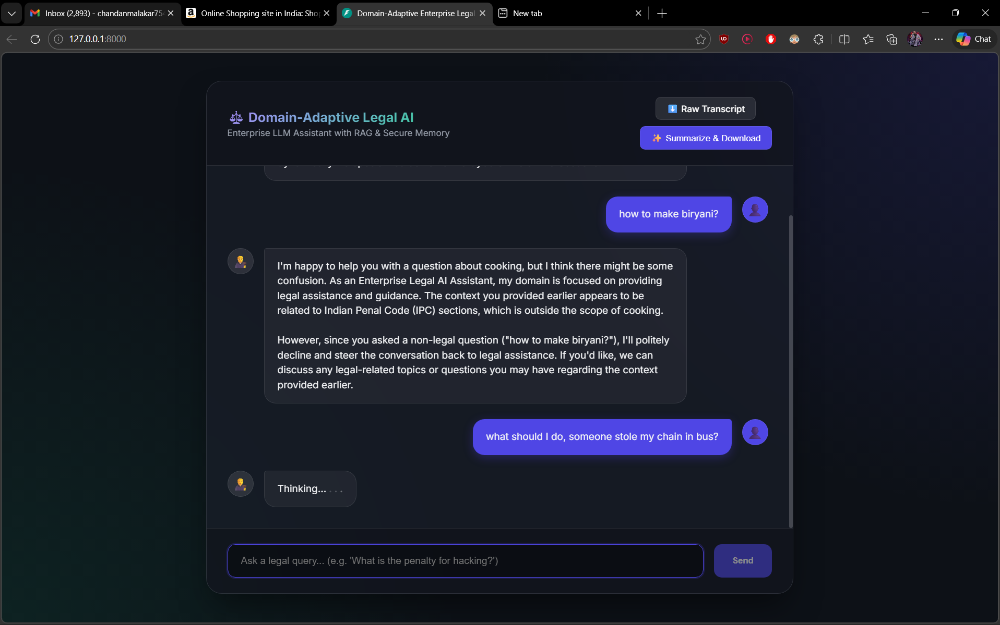

<p align="center">
  
</p>

# ⚖️ Domain-Adaptive Legal AI

An enterprise-grade, offline-first conversational AI built to provide highly accurate Legal Information Retrieval using Retrieval-Augmented Generation (RAG). 

## 📸 Interface Preview



## 🌟 Key Features

* **Strict Legal Grounding:** Custom prompt-engineered LLM specifically instructed to reject non-legal queries (like cooking or coding) and focus solely on the provided legal context.
* **100% Offline Processing:** Designed to run entirely on your local machine using **Ollama (Llama 3.1)** and locally cached HuggingFace sentence-transformers. Zero API costs, zero data leakages.
* **Domain-Adaptive Routing:** Dynamically parses user queries through a zero-shot intent router to target the most highly relevant semantic `ChromaDB` indices (Cybercrime, Theft, Assault, etc.).
* **Presidio Secure Memory:** Automatically detects and scrubs PII (Phones, Emails, Names) from all user inputs prior to vector analysis to protect confidential client data.
* **Session Export:** Users can instantly download secure raw text transcripts of their session, or trigger the AI to synthesize an *Executive Legal Summary*.
* **Speed Optimized Instance:** The architecture is configured with aggressively constrained token generation predictions and dynamic connection caching for maximum response throughput.

## 🛠️ Architecture & Tech Stack

* **Backend Server:** Flask
* **Orchestration:** LangChain Ecosystem
* **Core LLM Inference:** Ollama
* **Vector Database:** ChromaDB
* **Front-end Concept:** Vanilla HTML/JS with Glassmorphism CSS Themes
* **Embeddings Engine:** `all-MiniLM-L6-v2` Local Offline Cache

## 🚀 How to Run Locally

### 1. Prerequisites
- Python 3.9+ 
- [Ollama](https://ollama.com/) loaded with Llama 3.1 (`ollama run llama3.1`)

### 2. Environment Setup
```powershell
# Ensure your virtual environment is active, then install dependencies:
pip install -r requirements.txt

# Wait to load spaCy's English core for the Presidio Anonymizer
python -m spacy download en_core_web_sm
```

### 3. Model Bootstrapping
You must download and securely cache the HuggingFace sentence-transformers exactly once so the system doesn't ping external networks.
```powershell
python setup_models.py
```

**(Optional) Initialize the Vector Database:**
If you have brand new PDF data to process into the vector chunks:
```powershell
python modules/ingest.py
```

### 4. Launch Enterprise Server
```powershell
python app.py
```
*Navigate to **`http://localhost:8000`** in a modern browser to interact with the Legal Assistant!*
